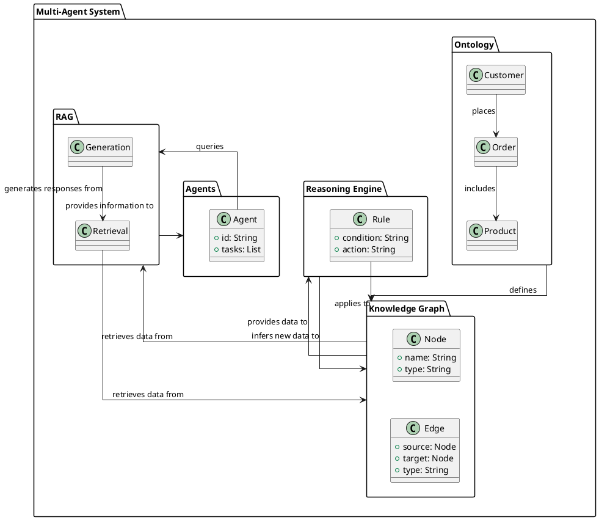

# Goal-Oriented BDI Multi-Agent Business Operating System (MABOS)

## Overview
The Goal-Oriented Belief-Desire-Intention (BDI) Multi-Agent Business Operating System (MABOS) is an advanced, intelligent platform designed to enhance business operations through the integration of autonomous agents. These agents utilize sophisticated reasoning and inferencing capabilities to manage goals, execute tasks, and deliver knowledge proactively. This system leverages cutting-edge technologies, including graph databases, ontologies, topic maps, and retrieval-augmented generation (RAG) via vector databases, to provide a robust and flexible solution for modern businesses.

## Key Features
1. **Proactive Knowledge Delivery**:
   - The MABOS integrates seamlessly with Process-Centered Software Engineering Environments (PSEEs) to deliver relevant knowledge proactively based on the user’s current tasks and software processes. Agents monitor user actions and provide pertinent information without requiring explicit queries, enhancing efficiency and usability.
2. **Integration with Business Processes**:
   - Knowledge Management (KM) activities such as creation, capture, retrieval, access, delivery, and maintenance are embedded into business processes. This integration ensures that knowledge delivery is context-aware and relevant to the tasks at hand, leveraging an organizational memory that stores artifacts, lessons learned, and message packages.
3. **Role-Based Agent Development**:
   - Agents are assigned specific roles that define their goals, plans, tasks, and actions, ensuring clear responsibilities and specialized task execution. This role-based approach enhances the agents' ability to perform specialized functions and manage complex workflows effectively.
4. **Advanced Reasoning and Inferencing**:
   - Agents utilize graph databases, ontologies, and topic maps to represent and reason about domain knowledge. This capability enables them to infer new knowledge and provide insights based on the existing data. Additionally, retrieval-augmented generation (RAG) via vector databases enhances the agents' ability to retrieve and synthesize information dynamically.

5. **Goal and Sub-Goal Management**:
   - The MABOS supports the definition and management of goals and sub-goals, allowing for nested goal structures. Agents can set primary goals, add sub-goals, and manage them effectively, ensuring that all aspects of the business operations are aligned with strategic objectives.
6. **Standardized Agent Development Framework (AgeODE)**:
   - The system includes a standardized infrastructure for developing and integrating agents, ensuring consistency and reusability. AgeODE defines agent classes, communication protocols, and access methods, facilitating seamless agent integration and coordination.
7. **Multi-Agent Coordination**:
   - The architecture includes general agents (such as Personal Assistant Agents, ODE’s Router Agents, and Similar Project Identifier Agents) and tool-specific agents. These agents work together to deliver relevant knowledge and support various business functions based on user actions and roles.

  
## Use Cases

1. **Business Process Automation**:
   - Automate complex business processes by assigning agents specific roles and goals. Agents can manage tasks, execute plans, and ensure that processes are completed efficiently and effectively.

2. **Proactive Knowledge Management**:
   - Enhance knowledge management by delivering relevant information to users based on their current tasks and activities. This proactive approach reduces the need for manual searches and improves decision-making.

3. **Strategic Goal Management**:
   - Define and manage strategic goals and sub-goals, ensuring that all business activities are aligned with the company's objectives. Agents can track progress, identify potential issues, and suggest corrective actions.

4. **Enhanced Customer Support**:
   - Deploy agents to manage customer interactions, provide personalized responses, and deliver relevant information based on the customer's history and current queries. This improves customer satisfaction and reduces response times.

## Technical Implementation

1. **Agent Class (agent.py)**:
   - The `Agent` class encapsulates the agent's BDI capabilities, including beliefs, desires, and intentions. It supports role assignment, goal setting, sub-goal management, task management, and knowledge inferencing using graph databases and vector databases.

2. **API Integration (onboarding_api.py)**:
   - The API provides endpoints for agent registration, role assignment, goal setting, sub-goal management, task management, and knowledge inferencing. These endpoints facilitate interaction between the agents and the system, ensuring seamless operation.

3. **Knowledge Base Integration**:
   - The system integrates with graph databases and vector databases to represent and manage knowledge. Agents use these databases to infer new knowledge, retrieve augmented data, and provide insights based on complex queries.

## Integration with Dify

### Agent Integration
- Understand the agent models and architectures used in both MABOS and Dify.
- Assess the feasibility and benefits of integrating or synchronizing the agent representations.
- Propose a mapping or integration strategy if deemed necessary, considering compatibility and development effort.

### Action/Task and Tool Integration
- Analyze the similarities and differences between MABOS actions/tasks and Dify tools.
- Assess the feasibility and benefits of integrating or mapping MABOS actions/tasks with Dify tools.
- Propose an integration or adaptation strategy, considering interface compatibility and required modifications.

### Planning/Execution and Workflow Integration
- Examine the alignment between MABOS planning/execution processes and Dify's workflow model.
- Identify necessary adaptations or extensions to integrate MABOS planning/execution with Dify workflows.
- Propose an integration strategy, considering workflow compatibility, required modifications, and coordination complexities.

### Data and Knowledge Integration
- Understand the data and knowledge management systems in both MABOS and Dify.
- Assess the compatibility and interoperability of MABOS data and knowledge with Dify's systems.
- Propose an integration strategy, considering data model compatibility, exchange protocols, and synchronization mechanisms.

### User Interaction and Control Integration
- Analyze the user interaction and control mechanisms in both MABOS and Dify.
- Assess the compatibility and feasibility of integrating MABOS user interaction and control with Dify's mechanisms.
- Propose an integration strategy, considering interface compatibility, required adaptations, and user experience consistency.

## Folder Structure

